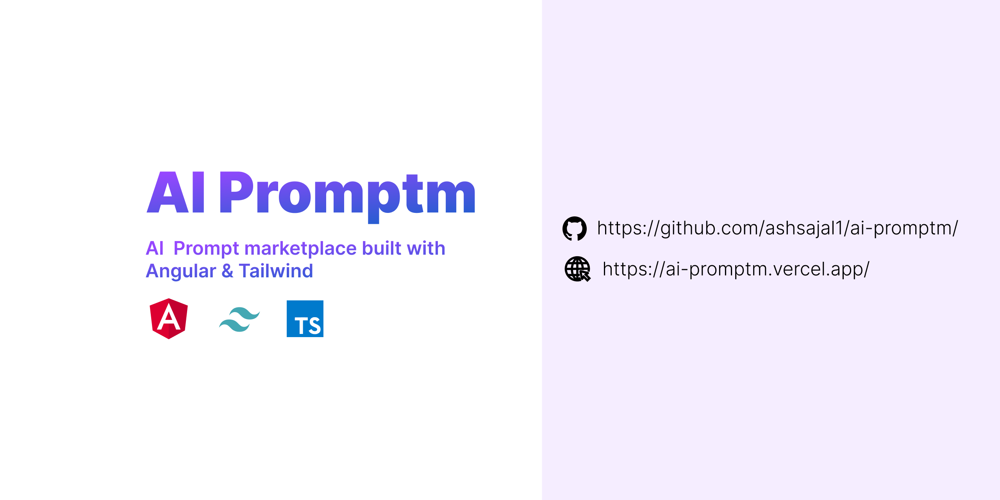

# AI Prompt Marketplace

[![License][]](https://github.com/ashsajal1/ai-promptm/blob/main/LICENSE)AI Prompt Marketplace is a web application built with Angular. It provides a platform for developers to discover and share AI prompts, which can be used to generate creative ideas and assist in various AI-related projects.## Features- Browse a collection of AI prompts- Search prompts by keywords or tags- Create an account and submit your own prompts- Like and comment on prompts- Bookmark prompts for future reference- Follow other users and receive updates on their prompts- Responsive design for a seamless experience across devices## Live DemoCheck out the live demo of the AI Prompt Marketplace: [ai-promptm.vercel.app](https://ai-promptm.vercel.app)## InstallationTo run the AI Prompt Marketplace locally, follow these steps:

1. Clone the repository: `git clone https://github.com/ashsajal1/ai-promptm.git`
2. Navigate to the project directory: `cd ai-promptm`
3. Install the dependencies: `npm install`
4. Start the development server: `ng serve`
5. Open your browser and visit `http://localhost:4200`

#### ContributingContributions are welcome! If you'd like to contribute to the AI Prompt Marketplace project, please follow the guidelines in the [CONTRIBUTING.md](https://github.com/ashsajal1/ai-promptm/blob/main/CONTRIBUTING.md) file.
#### Code of ConductPlease review and adhere to the [Code of Conduct](https://github.com/ashsajal1/ai-promptm/blob/main/CODE_OF_CONDUCT.md) when participating in the AI Prompt Marketplace community.
#### LicenseThis project is licensed under the [MIT License](https://github.com/ashsajal1/ai-promptm/blob/main/LICENSE).
#### ContactIf you have any questions or suggestions, feel free to open an issue on the [GitHub repository](https://github.com/ashsajal1/ai-promptm) or reach out to the project maintainer.

---Enjoy exploring and contributing to the AI Prompt Marketplace! We appreciate your support and hope this platform sparks creativity and innovation in AI projects.
